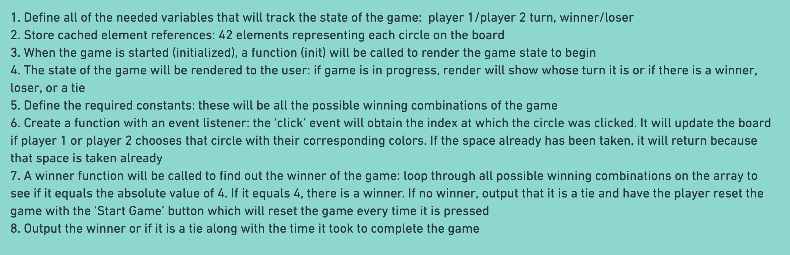

# **Connect Four**
#### Gone are the days of our carefree childhood filled with nostalgia such as building giant forts made from cardboard boxes or hours spent playing our favorite board games such as Connect Four. It’s not until we become adults do we realize how much of our childhood we actually miss. As my unit 1 project, I chose to recreate Connect Four with my very own twist and flare to bring back memories I’ve locked away for years. Recreating this game reminded me so much of my childhood where all we could do was be actual kids – playing outside, riding our bikes around the neighborhood, or playing games such as Connect Four. I hope you enjoy playing this game just as much as I had fun building it! 
---
### **Let's play** [**Connect Four!**](https://connect-four-leon-chu.netlify.app/)

#### Connect Four Rules:
#### Objective: Be the first player to connect four of the same colored squares in a row (either vertically, horizontally, or diagonally)
#### How To Play:
1. First, decide who goes first to determine what color each player will have
2. Players must alternate turns, and only one square can be dropped in each turn
3. On your turn, drop one of your colored squares from any open space in one the seven columns
4. The game ends when there is 4-in-a-row or the game will reach a tie
5. To restart the game, simply press the "Restart" button
---
### **Pseudocode:**

---
### **Wireframe:**

---
### **Post styling:**

---
### **Technologies Implemented:**
1. JavaScript
2. HTML
3. CSS
4. Bootstrap
---
### **Planned Future Enhancements**
- Add running timer to the top left corner and then display how long it took until there was a winner or tie
- Add a light/mode dark mode feature in the top right corner
- Add a feature to play against the computer
---
### **Credits**
- Background image: [Pixabay.com](https://pixabay.com/videos/search/motion%20backgrounds/?pagi=1&order=trending&cat=None)
- Color theme: [Mycolor.space](https://mycolor.space/)
- Favicon: [Icons8.com](https://icons8.com/icons/set/favicon)
- Box-shadow gradient: [Stackoverflow.com](https://stackoverflow.com/questions/9649706/css3-box-shadow-linear-gradient)
- Button sound: [Freesound.org](https://freesound.org/browse/tags/gaming/)

